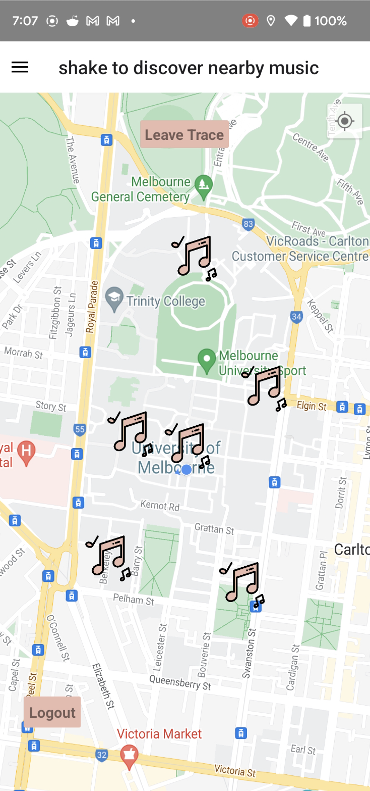
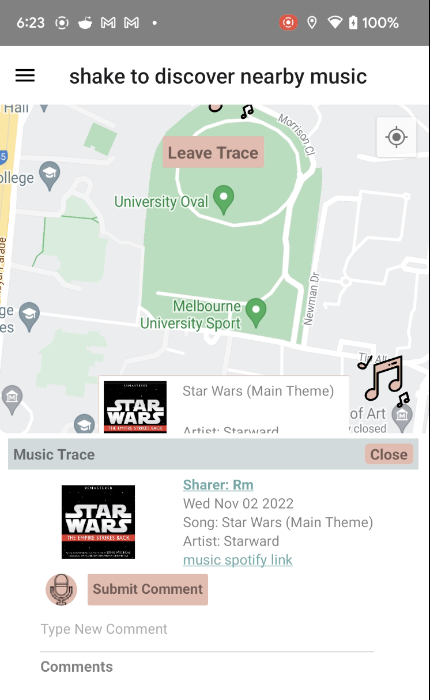
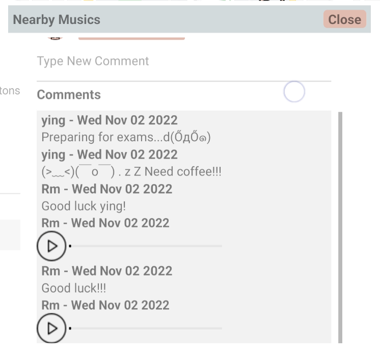
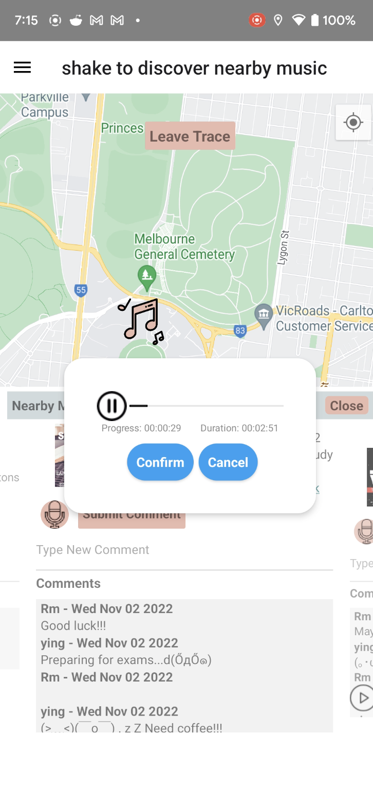

# Resonance 🎵

## What is Resonance 
We believe that nothing can substitute the memory and emotions for each individual. People express feelings through various ways, listening to music may be a good way to express feelings, make people feel included and resonating. **Resonance** is an android application that was designed and developed to enhance the interaction between people through music sharing, or simply, to document your memory. 

People walk through the same way, listening to the same music together. 

**Through Resonance, we connect people with music. Through music, we hear you.**

---
## How It Works 

In **Resonance**, you can connect your account with Spotify. Any moment, anywhere, you can leave a trace in the map along with one song that resonates with you. You could also follow other users and explore what they have left for their memory, or discover and interact with traces in your nearby locations. 

---
## Technology

Frontend: Node.js and React-Native

Backend: Node.js, Express.js, MongoDB

**Please note that we use free Heroku resources to deploy and serve our backend, which is due on Nov 28. If you need to access after this date, please contact the team and we will upgrade to a paid plan to continue the service.**

Build and Deployment:
- Backend is built and deployed to Heroku
- All avatar photos and audio comments are saved to Firebase
- Frontend needs to be built manually following the instructions below
- To run the App, only need to build frontend because backend has already been deployed in Heroku

---
## For Developers 
The backend for **Resonance** is deployed in Heroku. Detailed documentation of Api refers to [here](https://github.com/yongk1/resonance-backend). Currently, all you need is to run the frontend. 

### How to Run in an Emulator 

1. Git clone the project into your local device

2. Install Dependencies: 
-  `cd frontend`
- `npm install`

3. Configure and run an emulator in Android Studio

4. Start the app: `npx react-native run-android` 

### How to Run on a Real Phone
1. Follow step 1 & 2 in How to Run in an Emulator 

2. Connect to an Android Phone using USB

3. Run `adb devices` and record the \<device-number>

4. Run `adb -s <device-number> reverse tcp:8081 tcp:8081`

    **Note: To execute step 5 or 6, please make sure you don't have any version of the App installed**
     - Please uninstall all versions of this App on your phone

    5. Execute `npx react-native run-android`

    6. Can also start the app in release mode (This is only supported on a real phone, which will hide DevMenu and all warnings): 

        - Then run `npx react-native run-android --variant=release`

## TroubleShooting 

### Fail to npm install 

 -  Try  `npm install -—legacy-peer-deps`
 -  If it does not work, use  `npm install -—force`
    
    

### Fail to connect to the emulator in MacOS 

Please follow the step-by-step solution [here](https://github.com/facebook/react-native/issues/28712#issuecomment-617384353).

### Fail to build the app 

1. (In the **/frontend** directory) `cd android` 

2. `./gradlew clean`

3. `chmod 755 android/gradlew`

3. Go back to the **/frontend** directory and re-run `npx react-native run-android` 

---
## Features

### 1. Register/Login/Logout

Our application provides the normal login/out and registration with corresponding notification functions

Two login steps:
- log in with your email and password
- and log in with your Spotify account

Please log into Spotify with the following account:
- email: ProjectTest@gmail.com
- password: test123123

To enable users to login with Spotify account, users need provide us their Spotify account info, which is for us to add into our "allowlist" in Spotify Dashboard. Otherwise, user will not be able to use their own Spotify account to login. To remove this limit, the team needs to submit an "extension" request to Spotify to allow all users to log in without providing their account info to us. However, Spotify does not grant this request for Uni or hobby projects. As a workaround, the team decided to create a demo Spotify account for user who wants to use our App features to login. The purpose is to show that user can log into our App and use all features with a real Spotify account. If user does not log in with Spotify account, user can still access pages like User Profile, Edit Profile, Moment, etc.. However, user will not be able search any musics in the map.

Details can be referred to: [spotify-link](https://developer.spotify.com/documentation/web-api/guides/development-extended-quota-modes/)

**Registration**

**Registration Failed Notification**

**Login**

**Login Failed Notification**

### 2. View Music Traces

Click on the icon at the top right of the map to locate your current location and observe the music traces you left in history

  
  

### 3. Share Music at Current Location

You can leave you music trace at your current location

`Click on the icon at the top right of the map to get your current location -> Click Leave Trace -> Search your music -> Select your music and click Yes`

### 4. Shake to Find Other's Traces and Comment Them

You can find other's music traces just by shaking your phone

Both audio comment and text comment are supported

  
  

### 5. Follow Other Users and Check Their Trace

Follow other users and check their traces

`Shake to Find Other Music Trace -> Click Sharers' to Access Their Profiles -> Click Follow -> Access Moment via side drawer`

**Check Their Profile and Follow**

**See Their Traces in Moment**

### 6. Edit and Upload Your Profile

Our application provides profile editing function, you can find it in side drawer `Profile` section

`Open Side Drawer -> Click Profile -> Click Edit button in your profile page`

---
## References

### References in Script:

### Map Marker:

### Background Image/Avatar Photo Used in App:
- <a href="https://www.flaticon.com/free-icons/bot" title="bot icons">Bot icons created by Freepik - Flaticon</a>
- https://www.pexels.com/photo/two-yellow-emoji-on-yellow-case-207983/
- https://www.pexels.com/photo/blue-headphone-1037992/
- https://www.pexels.com/photo/black-headphones-with-mobile-smartphone-6320/
- https://www.pexels.com/photo/blue-vinyl-record-playing-on-turntable-1389429/